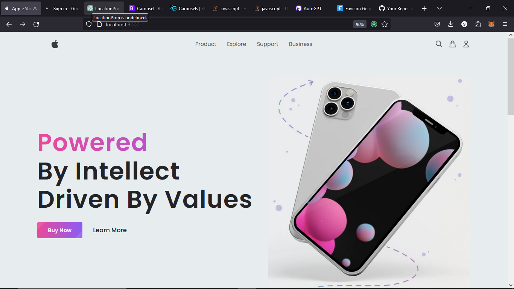
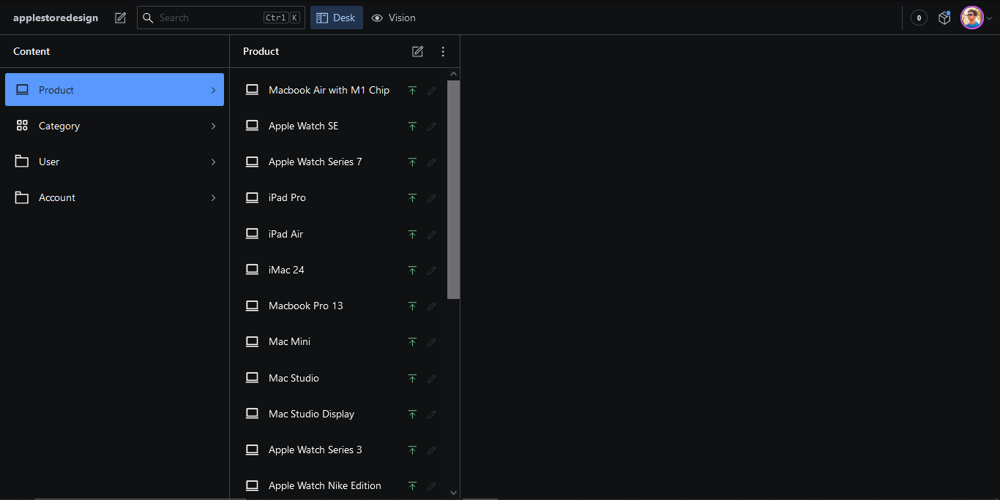

Apple Store

Apple Store is a modern e-commerce website built with Nextjs with Headless CMS Sanity. It provides a seamless shopping experience with features such as authentication, secure payment integration.

UI/UX

SANITY

Features

    User Authentication: Secure login and signup functionality for customers.
    Order Management: Users can browse and place orders for their desired products.
    Cart Management: Convenient cart functionality for adding, removing, and updating items.
    Secure Payments: Integration with Razorpay for safe and secure order payments.
    Admin Dashboard: Comprehensive control panel for managing products, orders, and Using Sanity.
    Image Upload: Seamless image upload and management using Sanity

Technologies Used

    Frontend: Nextjs, Tailwind, Sanity Headless CMS
    Payment Integration: Stripe

Getting Started

To run the Apple Store project locally, please follow these steps:

    Clone the repository:

bash

git clone https://github.com/alisohail2448/Apple-Store.git

    Install dependencies for the frontend and backend:

bash

    cd Apple-Store
    npm install
    npm run dev
    cd applestoredesign
    npm install
    sanity start

    Configure environment variables:

    Create a .env file in the root directory.
    Add the necessary environment variables as mentioned in .env.example.

    Run the project:

arduino

npm run dev

    Open your browser and visit http://localhost:3000 to access the Apple Store application.

sanity start

    Open your browser and visit http://localhost:3333 to access the Apple Store application.

Contributing

Contributions are welcome! If you'd like to contribute to the Apple Store project, please follow these guidelines:

    Fork the repository.
    Create a new branch.
    Make your changes and commit them.
    Push your changes to your forked repository.
    Submit a pull request detailing your changes.

